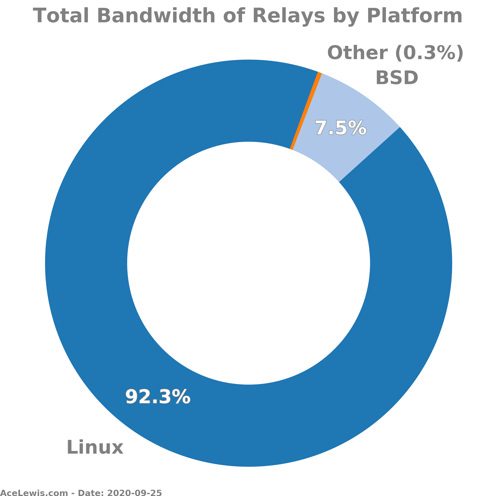

# tor-data-visualisation
 Visualisation of data about the Tor servers including the countries, bandwidth, number of nodes, versions, OS, and if they are exit or not.

The images are shown below, all images are in the [/images/](./images/) folder. This includes PNGs and SVGs. Re-run to get graphs for the latest data.

